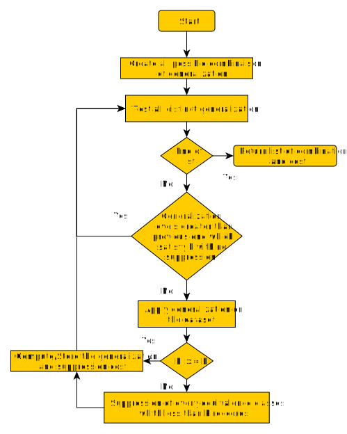

[](https://www.python.org/)    
[](https://npmjs.com/package/discord.js) [](https://github.com/Ltochon/k-ano_Tool/commits) [](https://github.com/Ltochon/k-ano_Tool/commits) [](https://github.com/Ltochon/k-ano_Tool) [](https://pypi.python.org/pypi/ansicolortags/)

# K-Anonymization Tool for databases

## Authors

- Louis Tochon
- Kévin Huguenin (Superviser)

## Table of contents
- [K-Anonymization Tool for databases](#k-anonymization-tool-for-databases)
  - [Authors](#authors)
  - [Table of contents](#table-of-contents)
  - [Arborescence des fichiers](#arborescence-des-fichiers)
  - [Goal](#goal)
  - [Description of the project](#description-of-the-project)
  - [The algorithms](#the-algorithms)
    - [SW (Proposal)](#sw-proposal)
    - [SSW (Proposal)](#ssw-proposal)
    - [Complexity comparison](#complexity-comparison)
      - [SW](#sw)
      - [SSW](#ssw)
  - [Milestones](#milestones)
  - [Run commands](#run-commands)
  - [Sources](#sources)

## Arborescence des fichiers

Omitted files are not required to understand the project.

```C
📦k-ano_Tool
 ┣ 📂.github\workflows //Configuration folder
 ┃ ┗ 📜python-app.yml //test environnement properties
 ┣ 📂Flask project //First Flask project to gain knowledge
 ┣ 📂K-anoTool //Flask project with the anonimization tool
 ┃ ┣ 📂Env //Virtual Python Env
 ┃ ┣ 📂Static //Static files (JS, CSS, IMG, Saved files)
 ┃ ┣ 📂Templates //HTML Templates
 ┃ ┣ 📂Upload //Sub-directory for Upload part of the project
 ┃ ┣ 📂Result //Sub-directory for Result part of the project
 ┃ ┣ 📂About //Sub-directory for About part of the project
 ┃ ┗ 📜app.py //launch project file
 ┣ 📂Presentation //Folder with powerpoint for meetings
 ┣ 📂Prototyping //Folder with prototypes of generalizytion interface
 ┣ 📂Test_algo //Algorithm's development folder
 ┃ ┣ 📂data
 ┃ ┣ 📂ideas //Ideas for improving algorithms
 ┃ ┣ 📂yed //Folder containing algorithm's graph 
 ┃ ┣ 📜datafly_v1_weighted.py //Proposal of datafly algorithm with weighted attributes
 ┃ ┣ 📜datafly_v1.py //Basic datafly algorithm
 ┃ ┣ 📜incognito_v1.py //First try with incognito algorithm
 ┃ ┣ 📜mondarian.py //Open Source Code for mondarian algorithm
 ┃ ┣ 📜samarati_tree.py //File to generate the distance matrix lattice for samarati algorithm
 ┃ ┣ 📜sw.py //Original proposal algorithm to include weights
 ┃ ┗ 📜ssw.py //Suppr_weighted_algo combined with samarati
 ┣ 📜test.py //test file
 ┣ 📜LICENSE
 ┗ 📜README.md

```
## Goal

The main goal of this project is to provide an anonymization tool to k-anonymize a database with algorithms based on weights for each attribute and to implement a tool to easily create the wanted tree of generalization. 

## Description of the project

To realize this project, the algorithm created needs to incorporate the weights at each level of generalization to describe the quantity of information lost. The algorithm proposed is called SW and basically tests every possible generalization level to find the smallest information lost. However, testing all combinations is not a viable solution due to the exponential time needed. To solve this problem, a second algorithm is proposed which is called SSW (for Samarati-SW). This one includes a binary search which enables avoiding combinations which are leading to a larger information loss than a previous solution found.

This anonymization algorithm will be deployed on a web application written in Python through the framework *Flask*. 

In a second time, an interface on the same web application will be created to provide a tool to the user to easily create his own tree of generalization. 

The crucial point of this project is to do a user-friendly tool with easy interactions to make the experience as simple as possible.

This project will focus on the medical domain to handle a single use case and go as deep as possible to provide a complete tool.

## The algorithms

### SW (Proposal)

<p align="center">
  
</p>

### SSW (Proposal)

<p align="center">
  
</p>

### Complexity comparison

#### SW

maximum generalization level = *n*   
number of qid = *k*   
number of combination of generalization's level = *n<sup>k</sup>*   
one-level generalization = *O(n)*   
max-level generalization = *O(k * n<sup>2</sup>)*   
anonimity level check = *O(n)*   
supression check = *O(n)*   

Final complexity level : *O(n<sup>k</sup> * (k * n<sup>2</sup> + n + n + n))* = *O(n<sup>k</sup> * (k * n<sup>2</sup> + 3n))* = *O(n<sup>k</sup> * n<sup>2</sup>)*

#### SSW

maximum generalization level = *n*   
number of qid = *k*   
number of combination of generalization's level = *n<sup>k</sup>*   
one-level generalization = *O(n)*   
max-level generalization = *O(k * n<sup>2</sup>)*   
anonimity level check = *O(n)*   
supression check = *O(n)*   

Final complexity level : *O(log<sub>2</sub>(n<sup>k</sup>) * (k * n<sup>2</sup> + n + n + n))* = *O(log<sub>2</sub>(n<sup>k</sup>) * (k * n<sup>2</sup> + 3n))* = *O(k*log<sub>2</sub>(n) * n<sup>2</sup>)*


## Milestones

(:heavy_check_mark: : Done | :hourglass_flowing_sand: : In Progress | :x: : Canceled)

1) Research about the *Datafly* algorithm :heavy_check_mark:
2) Gaining knowledge about Flask (first web application with Python) :heavy_check_mark:
3) Implementing *Datafly* algorithm :heavy_check_mark:
4) Algorithm's proposal with weighted attributes :heavy_check_mark:
5) Implementation of Flask application with the algorithm :heavy_check_mark:
6) Make Flask application be shiny :heavy_check_mark:
7) Prototyping the interface of custom generalization :heavy_check_mark:
8) Prototype testing :heavy_check_mark:
9) Implementation of the generalization's interface :heavy_check_mark:
10) Final application's usability tests :hourglass_flowing_sand:

## Run commands

After cloning, just write this line in your terminal at the root of the repository :

```
python K-AnoTool\app.py
```

This will launch the web tool on the port 5000 of your localhost.

## Sources

weight algo k-anon [28.02] : https://ieeexplore.ieee.org/stamp/stamp.jsp?tp=&arnumber=6663954

weight k-ano [28.01] : https://www.sciencedirect.com/science/article/pii/S0167404820300377

Mondrian [01.03] : https://personal.utdallas.edu/~muratk/courses/privacy08f_files/MultiDim.pdf

Incognito explained [01.03] : https://ieeexplore.ieee.org/stamp/stamp.jsp?tp=&arnumber=6406297

Datafly explained [02.03] : http://www.mathcs.emory.edu/~lxiong/cs573_s12/share/slides/03anonymity_generalization.pdf

Datafly wikipédia [02.03] : https://en.wikipedia.org/wiki/Datafly_algorithm

Improved Greedy vs Datafly [03.03] : http://www.tdp.cat/issues11/tdp.a100a12.pdf

Analysis of Datafly [03.03] :  https://kanonymity.github.io/ola.

Datafly explained [10.03] : https://dataprivacylab.org/datafly/paper2.pdf

Schema of core's principles of Datafly [10.03] : https://www.researchgate.net/publication/287537219_A_Systematic_Comparison_and_Evaluation_of_k-Anonymization_Algorithms_for_Practitioners

Distortion calcul with weighted attributes [15.03] : https://ieeexplore.ieee.org/stamp/stamp.jsp?tp=&arnumber=4606080

Anonymization by Local Recoding in Data with Attribute Hierarchical Taxonomies (Article)[22.03]

Datafly [4.4]: https://link.springer.com/content/pdf/10.1007/s00778-006-0008-z.pdf)

Incognito [4.4] : https://www.profsandhu.com/cs6393_s13/p49-lefevre_2005.pdf

Samarati [4.4] : http://www.sti.uniurb.it/events/fosad08/slides/samarati-2.pdf

Top-Down Specialization [4.4] : https://ieeexplore.ieee.org/stamp/stamp.jsp?tp=&arnumber=1410123
