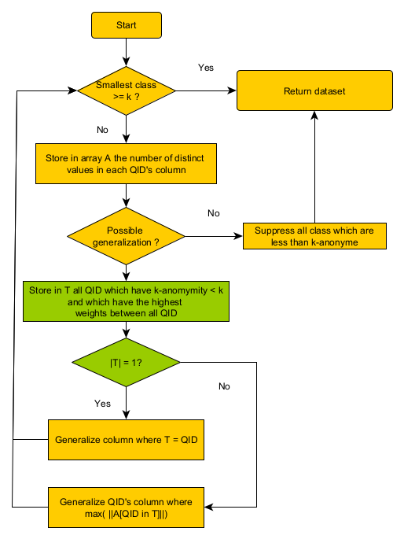

[](https://www.python.org/)    
[](https://npmjs.com/package/discord.js) [](https://github.com/Ltochon/k-ano_Tool/commits) [](https://github.com/Ltochon/k-ano_Tool/commits) [](https://github.com/Ltochon/k-ano_Tool) [](https://pypi.python.org/pypi/ansicolortags/)

# K-Anonymization Tool for databases

## Authors

- Louis Tochon
- Kévin Huguenin (Superviser)

## Table of contents
- [K-Anonymization Tool for databases](#k-anonymization-tool-for-databases)
  - [Authors](#authors)
  - [Table of contents](#table-of-contents)
  - [Arborescence des fichiers](#arborescence-des-fichiers)
  - [Goal](#goal)
  - [Description of the project](#description-of-the-project)
  - [The algorithms](#the-algorithms)
    - [Datafly](#datafly)
    - [Datafly-weighted](#datafly-weighted)
  - [Milestones](#milestones)
  - [Run commands](#run-commands)
  - [Sources](#sources)

## Arborescence des fichiers

Les fichiers omis sont des fichiers internes aux programmes utilisés et ne devraient pas être modifiés.

```C
📦k-ano_Tool
 ┣ 📂.github\workflows //First Flask project to gain knowledge
 ┃ ┗ 📜python-app.yml //test environnement properties
 ┣ 📂Flask project //First Flask project to gain knowledge
 ┣ 📂K-anoTool //Flask project with the anonimization tool
 ┃ ┣ 📂Env //Virtual Python Env
 ┃ ┣ 📂Static //Static files (JS, CSS, IMG, Saved files)
 ┃ ┣ 📂Templates //HTML Templates
 ┃ ┣ 📂Upload //Sub-directory for Upload part of the project
 ┃ ┣ 📂Result //Sub-directory for Result part of the project
 ┃ ┣ 📂About //Sub-directory for About part of the project
 ┃ ┗ 📜app.py //launch project file
 ┣ 📂Sources //Folder to save sources that have been used
 ┣ 📂Test_algo //Algorithm's development folder
 ┃ ┣ 📂data
 ┃ ┣ 📂yed //Folder containing algorithm's graph
 ┃ ┣ 📜incognito_v1.py //First try with incognito algorithm
 ┃ ┣ 📜mondarian.py //Open Source Code for mondarian algorithm
 ┃ ┣ 📜datafly_v1.py //Basic datafly algorithm
 ┃ ┗ 📜datafly_v1_weighted.py //Proposal of datafly algorithm with weighted attributes
 ┣ 📜test.py //test file
 ┣ 📜LICENSE
 ┗ 📜README.md

```
## Goal

The main goal of this project is to provide an anonymization tool to k-anonymize a database with algorithms based on weights for each attribute and to implement a tool to easily create the wanted tree of generalization. 

## Description of the project

The algorithm called *Datafly* is an algorithm for providing anonymity in medical data [[1](https://en.wikipedia.org/wiki/Datafly_algorithm)] and is computationally efficient (and practicaly implementable) [[2](http://www.mathcs.emory.edu/~lxiong/cs573_s12/share/slides/03anonymity_generalization.pdf)]. This algorithm is based on a greedy approach and global generalization with tuples suppression [[3](http://www.tdp.cat/issues11/tdp.a100a12.pdf)] [[4](https://kanonymity.github.io/ola.pdf)]. The goal will be to use this algorithm to provide k-anonymity of a dataset by incorporating weights on the attributes to evaluate the importance of each one of them. Indeed, the main purpose of this project is to allow the user to choose which one of the different attributes must be generalized first and on the opposite side, which one must not be generalized. 

This anonymization algorithm will be deployed on a web application written in Python through the framework *Flask*. 

In a second time, an interface on the same web application will be created to provide a tool to the user to easily create his own tree of generalization. 

The crucial point of this project is to do a user-friendly tool with easy interactions to make the experience as simple as possible.

This project will focus on the medical domain to handle a single use case and go as deep as possible to provide a complete tool.

## The algorithms

### Datafly

<p align="center">
  
</p>

### Datafly-weighted (Proposal)

<p align="center">
  
</p>

## Milestones

(:heavy_check_mark: : Done | :hourglass_flowing_sand: : In Progress | :x: : Canceled)

1) Research about the *Datafly* algorithm :heavy_check_mark:
2) Gaining knowledge about Flask (first web application with Python) :heavy_check_mark:
3) Implementing *Datafly* algorithm :heavy_check_mark:
4) Algorithm's proposal with weighted attributes :heavy_check_mark:
5) Implementation of Flask application with the algorithm :heavy_check_mark:
6) Make Flask application be shiny :hourglass_flowing_sand:
7) Prototyping the interface of custom generalization :hourglass_flowing_sand:
8) Prototype testing
9) Implementation of the generalization's interface
10) Final application's usability tests

## Run commands

After cloning, just write this line in your terminal at the root of the repository :

```
python K-AnoTool\app.py
```

This will launch the web tool on the port 5000 of your localhost.

## Sources

weight algo k-anon [28.02] : https://ieeexplore.ieee.org/stamp/stamp.jsp?tp=&arnumber=6663954

weight k-ano [28.01] : https://www.sciencedirect.com/science/article/pii/S0167404820300377

Mondrian [01.03] : https://personal.utdallas.edu/~muratk/courses/privacy08f_files/MultiDim.pdf

Incognito explained [01.03] : https://ieeexplore.ieee.org/stamp/stamp.jsp?tp=&arnumber=6406297

Datafly explained [02.03] : http://www.mathcs.emory.edu/~lxiong/cs573_s12/share/slides/03anonymity_generalization.pdf

Datafly wikipédia [02.03] : https://en.wikipedia.org/wiki/Datafly_algorithm

Improved Greedy vs Datafly [03.03] : http://www.tdp.cat/issues11/tdp.a100a12.pdf

Analysis of Datafly [03.03] :  https://kanonymity.github.io/ola.

Datafly explained [10.03] : https://dataprivacylab.org/datafly/paper2.pdf

Schema of core's principles of Datafly [10.03] : https://www.researchgate.net/publication/287537219_A_Systematic_Comparison_and_Evaluation_of_k-Anonymization_Algorithms_for_Practitioners
